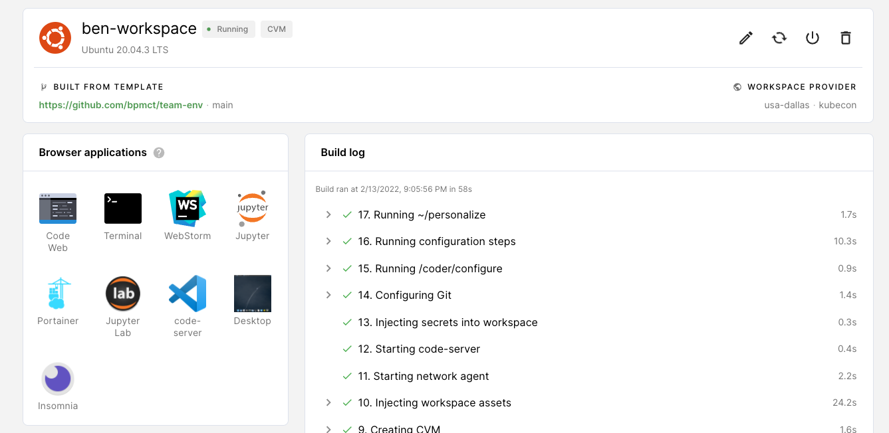

# team-env

An example Coder workspace with a lot of powerful features.



Open in Sandbox (during live workshops):

[](https://sandbox.coder.com/wac/build?project_oauth_service=github&template_oauth_service=github&project_url=git@github.com:bpmct/team-env.git&template_url=https://github.com/bpmct/team-env&template_ref=main&template_filepath=.coder/coder.yaml)

Or your Coder deployment:

1. Navigate to your Coder deployment
1. Ensure you've added the image from DockerHub to Coder: `bencdr/bookshop-monorepo:latest`
1. Ensure "Workspace Templates" are turned on under Manage -> Admin.
1. Create New Workspace -> From Template
    ```text
    Repository URL: https://github.com/bpmct/team-env
    Branch: main
    Template: .coder/coder.yaml
    ```

## Applications

- Custom code-server (VS Code) Version
- WebStorm (JetBrains IDE)
- Jupyter Notebooks
- Remote desktop (VNC)
    - Web VNC Client (noVNC)
    - Insomnia 
    - Portainer
- Podman (container management GUI)
- code-server (specific version)
- JupyterLab (via dev URL)

## Custom image

- Extends Coder's [VNC](https://github.com/cdr/enterprise-images/tree/main/images/vnc) image to include remote desktop support
- Custom image that installs applications, dev tools, and dependencies
- Node.js 16 and Yarn

## Project

Simple node starter blog in `src` folder: https://gatsbystarterblogsource.gatsbyjs.io/

## Workspace template

- See template in [.coder/coder.yaml](.coder/coder.yaml)
